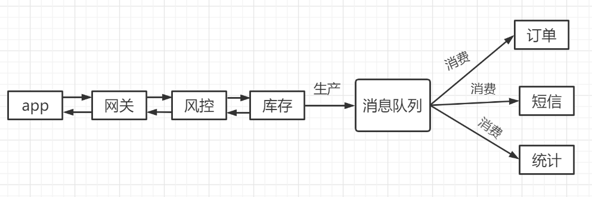
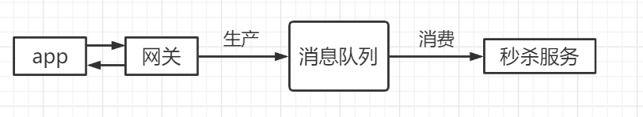
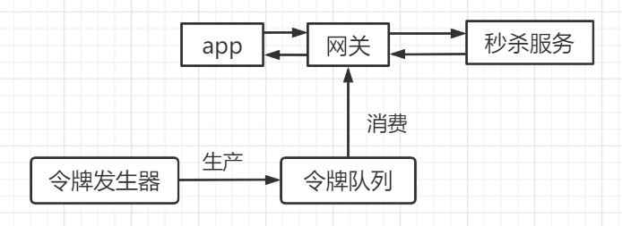

### 一、消息队列的使用场景

**1.异步处理**

我们以电商秒杀场景为例，当一个秒杀请求过来时，会包含许多步骤，例如：

- 风险控制；
- 库存锁定；
- 生成订单；
- 短信通知；
- 更新统计数据；

一个正常的处理流程是这样的：app将请求发送给网关，然后依次执行上述步骤，最后返回结果给app。

但实际上，决定用户能否秒杀成功的只有**风险控制**和**库存锁定**两个步骤，我们完全可以在这两步完成后就给用户返回秒杀结果，然后把请求的数据放入**消息队列**中，由消息队列**异步**的进行后续操作。

服务异步处理的**优点如下**：

- **可以更快的返回结果；**
- **减少了服务之间的等待，实现了步骤之间的并发，提高了系统的总体性能；**

**2.流量控制**

在请求特别多的情况下，可以通过**消息队列实现流量的控制**，具体有以下两种方式。

（1）**通过消息队列来隔离网关和后端服务，达到流量控制。**

- 网关在收到请求后，将请求放入**请求消息队列**；
- 后端服务从队列中获取请求，处理完成后返回结果；

这样当大量请求到达网关时，会先进入消息队列，然后**后端根据自己的处理能力去队列中拉取消息，调节流量**，达到“削峰填谷”的作用。如果请求超时则直接丢弃，app将其视为秒杀失败。如果需要增加消费端的消费能力，则可以直接增加服务的实例数量，进行水平扩容。

这种设计的弊端如下：

- 增加了系统调用链环节，导致总体响应时延变长；
- 上下游系统都要将同步调用改为异步消息，增加系统复杂度；

（2）**如果能预估出（秒杀）服务的处理能力，可以使用消息队列实现令牌桶，更简单的进行流量控制。**

> **令牌桶实现流量控制原理如下**

单位时间内只发放固定数量的令牌到令牌桶中，规定服务在处理请求之前必须先从令牌桶中获取一个令牌，如果获取不到令牌，则拒绝请求。

通过消息队列实现令牌桶，不需要破坏原先的调用链，只用在网关处理app请求时增加一个获取令牌的逻辑即可。

令牌桶可以简单的通过一个**固定容量的消息队列（令牌队列）**和一个**令牌发生器**来实现。

令牌发生器按照预估的处理能力，匀速生产令牌并放入令牌队列，如果队列满了则丢弃令牌。网关在收到请求时会先从令牌队列消费一个令牌，获取到令牌后再调用后续服务。

**3.服务解耦**

消息队列还可以实现在**模块**、**服务**、**接口**、**系统应用**之间不同粒度的解耦。

例如当我们创建一个新订单时，不同的系统要进行不同的操作：

- 支付系统需要发起支付流程；
- 风控系统需要审核订单的合法性；
- 客服系统需要给用户发短信；
- 经营分析系统需要更新统计数据；

由于下游的系统是不断进行变化的，所以订单模块需要不断进行修改和调试来和下游接口进行对接。每次修改完成后再重新上线，是非常麻烦的。

引入消息队列后，订单模块只需要将发送到队列中，下游的服务无论怎样变化，都是从队列中获取订单即可，订单模块无需进行变动，便可以实现订单模块与下游服务的解耦。

**4.作为发布/订阅系统实现一个微服务级系统间的观察者模式**

**5.连接流计算任务和数据**

**6.用于将消息广播给大量接受者**

### 二、消息队列存在的问题和局限性

1.引入消息队列会带来延迟问题

2.增加了系统的复杂度

3.可能 产生数据不一致的问题

> **总结**

**适用的场景**如：秒杀、发邮件、发短信、高并发订单等。

**不适用场景**如：银行转账、电信开户、第三方支付等。