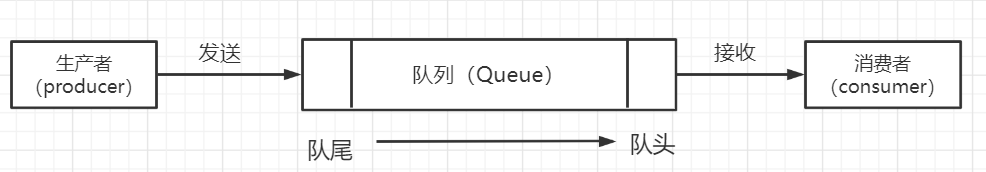
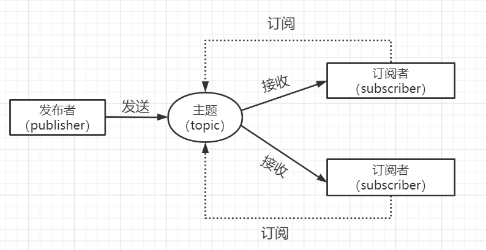
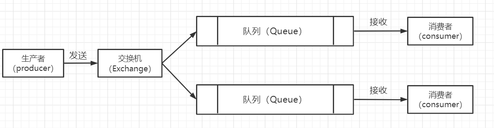
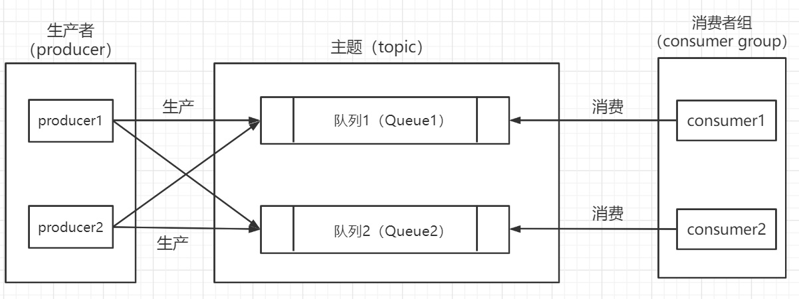

#### 一、选择消息队列的基本标准

不同的消息队列产品在**功能**和**特性**方面是各有优劣的，但是我们在选择的时候应尽量保证一个通用的最低标准。

**1.必须是开源的产品**

开源很重要，如果在使用该产品时遇到了影响业务的bug，可以通过修改源代码来进行修复。否则就只能等待开发者发布下一个版本了。

**2.必须是近年来比较流行且有一定社区活跃度的产品**

流行的好处是我们遇到的bug会比较少，其次，流行的产品与周边生态系统会有比较好的集成和兼容。例如flink内置了kafka的data source，使用kafka很容易作为flink的数据源开发流计算应用。

**3.必须包括几个重要的特性**

- 消息的可靠传递，确保不丢消息。
- 支持集群。
- 具备足够好的性能。

#### 二、不同的消息队列对比

对于消息队列来说，主要有两种模型：**点对点队列模型**和**发布/订阅模型**。**二者的最大区别在于一份消息数据能否被消费多次的问题。**

> **点对点队列模型**

> **发布/订阅模型**

实际上在发布/订阅模型中，如果只有一个订阅者，那么它和队列模型基本是一样的。也就是说，**发布/订阅模型在功能层面上是可以兼容队列模型的**。

**1.RabbitMQ**

> **优点**

- 轻量级、迅捷，容易部署和使用，开箱即用；
- 是少数支持AMQP协议的消息队列之一；
- 在`Producer`和`Queue`之间增加了一个`Exchange`模块（可以理解为交换机），可以自由实现路由规则，使得路由配置更加灵活；
- 支持的编程语言是消息队列中最多的，如果开发的系统使用的是冷门编程语言，可以找到对应的RabbitMQ客户端。

> **缺点**

- **对消息堆积的支持不好。**在它的设计理念中，消息队列是一个管道，不应当大量堆积消息。所以当消息大量积压时，会导致性能急剧下降。
- **相比其他消息队列性能较差。**每秒可以处理几万到十几万消息，不过如果要求更高则应该选择其他消息队列。
- **使用Erlang语言开发，不易进行维护。**Erlang语言不易学，很难对RabbitMQ进行扩展和二次开发。

RabbitMQ使用的是**队列模型**，它通过配置`Exchange`模块来将消息投放到多个队列，来实现**发布/订阅模式**。

**2.RocketMQ**

> **优点**

- 阿里内部双11使用，性能、可靠性、稳定性都值得信赖，每秒处理几十万条消息。
- 中文社区比较活跃。
- 使用java开发，易于对其进行扩展和二次开发。
- **收到消息后直接发送，响应时延很低，可以做到毫秒级别。**

> **缺点**

- 作为国产消息队列，在国际上没有那么流行，与周边生态系统的集成和兼容稍差。

RocketMQ使用的是**发布/订阅模型**，通过**消费者组**来实现对消息的重复消费。**同一个消费者组中的消费者只能消费不同的队列，不同消费者组中的消费者可以消费同一队列。**

**3.Kafka**

> **优点**

- **与周边生态系统兼容性最好，尤其在大数据和流计算领域，所有相关开源软件系统都会优先支持kafka。**
- 在数据可靠性、稳定性和功能特性等方面可以满足绝大多数场景需求。
- 异步收发的性能是三者中最好的，但是与RocketMQ没有量级上的差异。
- 使用java和scala进行开发。

> **缺点**

- **不太适合在线业务场景。**由于kafka是批量发送数据的，所以在消息数量不是很多时，时延反而比较高。

kafka同样使用**发布/订阅模型**，它同样通过消费者组实现重复消费，不过RocketMQ中的队列（Queue）在kafka中称为分区（Partition）。

**4.Pulsar**

新兴的开源消息队列，采用存储和计算分离的设计，成熟度还没有很高。

**5.ActiveMQ**

老一代消息队列，逐渐淘汰。