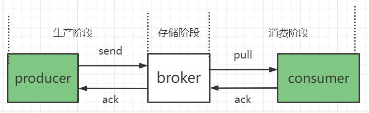

对于大部分业务系统来说，丢消息意味着数据丢失，是无法接受的。但其实现在主流的消息队列都提供了完善的消息可靠性保证机制，可以做到在消息传递过程中，即使发生网络中断或者硬件故障，也能保证消息的可靠传递。

**绝大部分丢消息的原因都是由于没有正确使用和配置消息队列导致的。**

### 一、检测消息是否丢失

我们要保证消息的可靠交付，首先就要知道消息是否丢失了。如何做到这一点呢？

对于IT基础设施比较完善的公司，可以使用**分布式链路追踪系统**来追踪每一条消息。如果没有这样的系统，可以使用**消息的有序性**来验证是否有消息丢失。原理很简单，**我们在producer端给每个发出的消息附加一个连续递增的序号，然后在consumer端检查这个序号的连续性**。

如果消息没有丢失，那么consumer收到的消息序号必然是递增的，如果检测到序号不连续，那就可以确定是消息丢失的，丢失的消息就是缺少的序号。

> 大多数消息队列的客户端支持**拦截器机制**，在`producer`发送消息之前的拦截器中将序号注入到消息中，在`consumer`收到消息的拦截器中检测序号的连续性。这样消息检测的代码不会侵入到业务代码，等系统稳定后可以删除这部分逻辑。

对于Kafka和RocketMQ来说，不保证消息在topic上严格有序，但是保证在队列/分区上是有序的，所以我们发送消息时要指定分区，然后在分区上检测消息序号的连续性。

其次，`consumer`数量和分区数量一致比较容易对消息序号进行检测。

### 二、确保消息可靠传递

首先我们要知道什么时候可能会丢失消息，然后才能进行针对性的措施。

一条消息从生产到消费完成，分为如下三个阶段：

**1.生产阶段**

> 在该阶段，消息队列通过**请求确认机制来保证消息的可靠传递**。

当producer给broker发送消息时，broker收到消息后会返回给客户端一个**确认响应**，表示消息已收到。**只要producer收到了这个确认响应，就可以保证消息不会丢失**。如果长时间没有收到响应会进行重发消息，如果一直失败则会返回一个异常或者返回值。

**注意：要正确处理返回值或者捕获异常，才能完全保证消息不会丢失！如果是异步发送的话，需要在回调方法进行检查。**

**2.存储阶段**

> 如果对消息的可靠性要求非常高，可以通过**配置broker参数来避免因宕机而丢消息**。

- 对于**单节点的broker**，需要配置参数使得**将消息写入磁盘后再给`producer`返回确认响应**。例如在RocketMQ中，将刷盘方式`flushDiskType`配置为`SYNC_FLUSH`同步刷盘。

- 对于broker集群，需要配置为：**至少将消息发送到两个以上的节点再返回确认响应**。

**3.消费阶段**

> 在该阶段，**不要在收到消息后就立即发送消费确认，而是应该再执行完所有消费业务逻辑之后，再发送消费确认**。

客户端从broker拉取消息后，执行用户消费的业务逻辑，成功后再给broker发送消费确认响应。如果broker没有收到响应，下次拉取时还会拉取同一条消息。